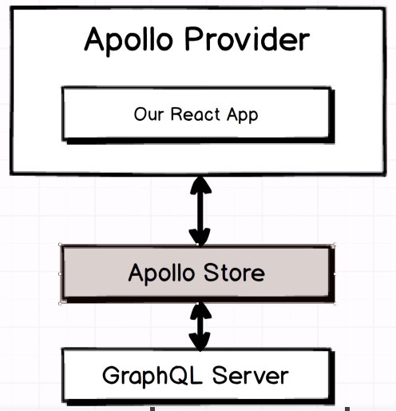
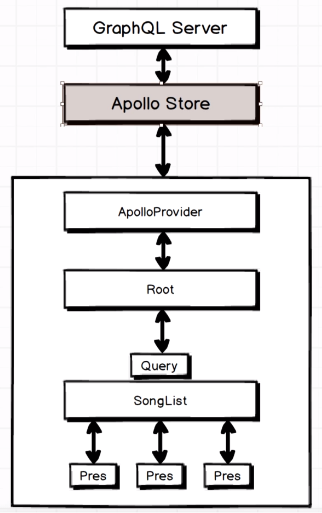
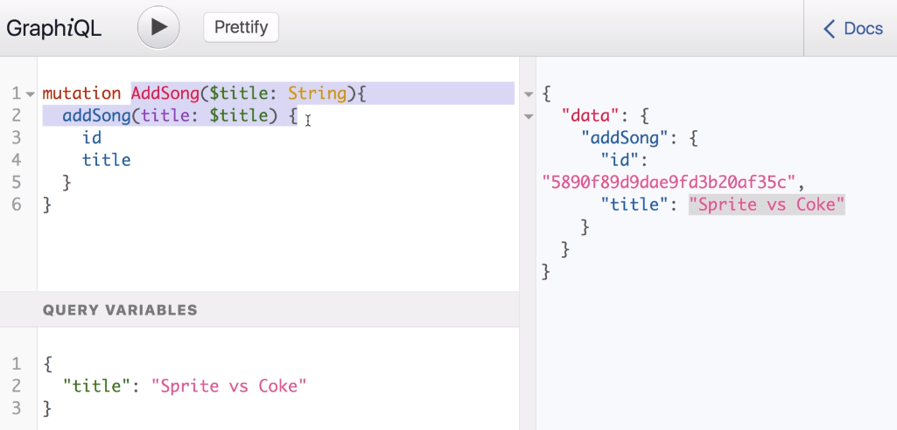
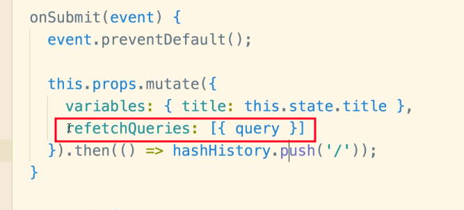
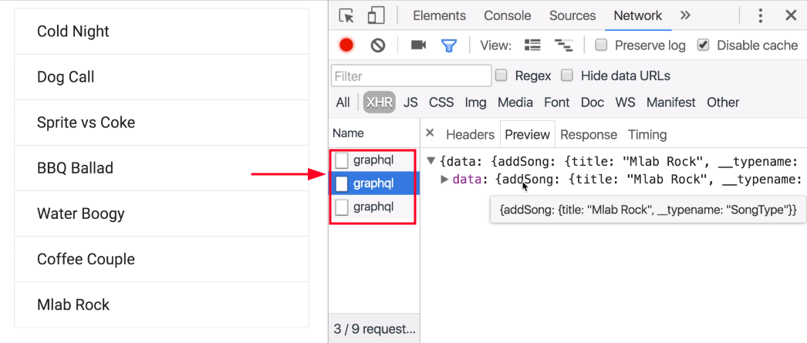
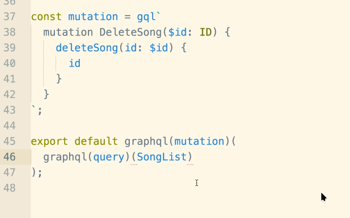
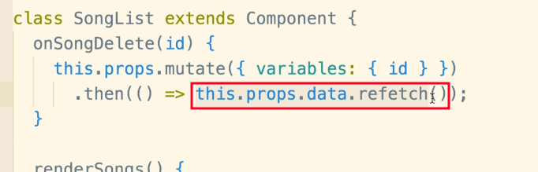
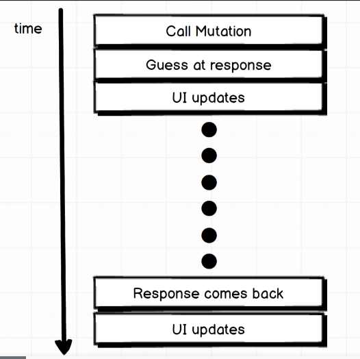
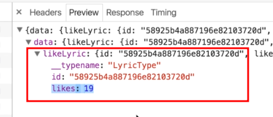

# Blog GraphQL

This is a web-app that uses GraphQL for query access

When I started building this app, there were challenges I had to deal - this include outdated modules and outdated Apollo. So, I had to configure **webpack.config** to build the **client** and connect this to our **server**(by using **express** and locate the **dist**).

```javascript
npm run build // webpack --mode development

// Run client using webpack-dev-server
webpack-dev-server --mode development

// Run server using nodemon
nodemon index.js --ignore client

```

## Web Application System Architecture

### User

- id: Unique identifier for the user.
- username: The user's username.
- email: The user's email address.
- password: The user's password (ensure this is securely hashed in a real application).

### Post

- id: Unique identifier for the post.
- title: The title of the blog post.
- content: The content of the blog post.
- authorId: The ID of the user who authored the post.
- createdAt: The timestamp when the post was created.
- updateAt: The timestamp when the post was updated.

### Comment

- id: Unique identifier for the comment.
- postId: The ID of the post the comment belongs to.
- authorId: The ID of the user who authored the comment.
- content: The content of the comment.
- createdAt: The timestamp when the comment was created.
- updateAt: The timestamp when the post was updated.

Here's a quick overview of the relationships:

1. A User can author multiple Posts.
2. A User can also write multiple Comments.
3. A Post can have multiple Comments.

## Apollo Server



**Apollo Store**

- What is going to communicate directly with the GraphQL server and store data that comes back from it
- A store of data that exists on the client side of our applications
- A client side repository of all the data that is coming back from the GraphQL server

**Apollo Provider**

- The integration layer between the Apollo store and our actual React application
- A provider of data to our application, the provider will take data from the store and inject it into our application

## Music Lyric System Architecture (somewhat similar to our structure)



- At the top, we have the **GraphQL Server** which is hosting our data.
- Next, the **Apollo Store** which is the point of contact/middleware between the **GraphQL Server**. This makes sure that any data that comes from the **GraphQL Server** is being distributed throughout the application.
- **ApolloProvider** acts as middleware for the **React** side of things and the **Apollo Store**.
- **Root** component which is displaying the **Query** which has an attached **SongList**
- Note: for an **Apollo** application like this project, we tend to pick a centralized components like the **SongList** as receiving the queries. Then manipulate these data down to the child component **props**

## UseMutation Syntax



- When we want to pass arguments to a **GraphiQL** query, we can do this by utilizing **Query Variables**. In this event, we first named the mutation (e.g. **AddSong**). This performs like a function with some arguments we want to pass to and (with dollar sign **$**) the argument type (similar to **TypeScript**).

## Refetching Query: Part 1




- Similar to useQuery React, the data is cached after a data has been submitted. In this case, we need to refetch the data again. The attached image above shows how it can be done using **Class-based Components** but for our approach, we will follow the documentation which is using **Function-based Components**.
- The **query**(in ES6 format because query:query => query) value inside **refetchQueries** is the GraphQL query for collecting the **SongList** (in our case, the PostList)
- **NOTE**: We might assume that refetch will happen again because of our **redirection** to **SongList** after a data has been submitted. But **Apollo** correctly identifies the query has ran once and will not run again (see second image).

## Handling Multiple Queries in a Single Component



- What happen here is we are calling **graphql** helper two times.
- In this case, we have two graphql queries, **query**(createSong) and **mutation**(deleteSong). Note that this are from the examples.

## Refetching Query: Part 2



- There are two ways we can refetch a query. This can be done inside a **.then** and utilizing **refetch** function.
- This should only be applied when the data is associated on the same component(e.g. the **deleteSong** event is within the **SongList** component, so after this event, we can refetch the data using the **refetch\***)
- We can also use the approach below, it depends to your personal taste.


- On this case, we are trying to **refetch** the data inside **SongList** from **SongCreate** component, so we should use this approach.

## Refetching Query: Part 3(Using dataIdFromObject)

- Remember, the big takeaway here was that when Apollo fetches data for our application, it really has no idea about what piece of data is what. So we have to help APollo understand which piece of data is which that allows it to more effectively tell the dark side of our application to when a certain piece of data is updates. So in general, the big challenge here is how do we tell Apollo about what record is what! To do this, we can do this by using:

```javascript
// Note: This is a pseudocode and not our actual code
// index.js
const client = new ApolloClient({
  // This piece of configuration right here takes every single piece of data that is fetched by our Apollo
  // client from the backend. Every piece of data and run it on this function. The result of this function is used to
  // identify that piece of data inside of the Apollo store or inside of the Apollo client.

  // In our current setup, we are telling to look for every piece of data/record and use the ID field of that record to
  // identify that piece of data. If we don't set this up, we are telling Apollo not to use the 'id' as the identifier because maybe the 'id' property is not unique. We should only use this when the IDs inside our application is unique.

  // Now that we have completed setting this up, whenever we make a query - we have to make sure that we return the 'id'
  dataIdFromObject: (o) => o.id,
});

// LyricCreate.js
// As you can see, every GraphQL query is returning the 'id' property, even inside 'lyrics'
const mutation = gql`
  mutatin AddLYricToSong($content: String, $songId: ID){
  addLyricToSong(content:$content, songId: $songId){
  id
  lyrics {
    id    
    content
  }
  }
  }
`;
```

## Optimistic UI Updates



1. When we call a mutation, we ask for any response and guess at what the response is when it comes back.
2. Apollo is going to take that guess of what we think the response is going to be and it's going to apply to the data insie of its internal store.
3. It will then instantly going to rerender our React application with this new guess at what our data should be.
   (Simultaneously, the mutation is going to be issued to our backend as network request. So that request is going to be pending for that quarter or half a second that we are already waiting)

4. When the mutation resolves and the response comes back, Apollo will take that response and then update it local copy of data to match whatever the response is actually said. And ten it will update our UI with whatever the real data is from the backend server.

```javascript
// Thi is a pseudocode
const onLike (id, likes){
  addLike({
    variables: { id },
    optimisticResponse: {
      // The reason why the value here is "Mutation" is generally because we are saying 'what is the event happening?' - and that is we are using 'Mutation'
      __typename: "Mutation",
      // Next part are the properties that we expect to see from the response from the backend server(see likeLyric response log image below)
      likeLyric: {
        id,
        __typename: "LyricType",
        likes: likes + 1
      }
    }
  })
}


```

#### likeLyric response log:



## Apollo readQuery and writeQuery

### readQuery

- Enables you to execute a GraphQL query directly on your cache,
- If your cache contains data for all of the query's fields, **readQuery** returns an object that matches the shape of the query.
- To successfully execute queries with variables, the field with the specified argument must already be in the cache.
  Otherwise the client treats the data as missing and **readQuery** returns null.
- If the cache is missing data for any of the query's fields, **readQuery** returns null. It does not attempt to fetch data from your GraphQL server.
- The query you provide readQuery can include fields that are not defined in your GraphQL server's schema (i.e., local-only fields).

### writeQuery

- Enables you to write data to your cache in a shape that matches a GraphQL query. It resembles readQuery, except that it requires a data option

Note the following about writeQuery:

- Any changes you make to cached data with writeQuery are not pushed to your GraphQL server. If you reload your environment, these changes disappear.
- The shape of your query is not enforced by your GraphQL server's schema:
- - The query can include fields that are not present in your schema.
- - You can (but usually shouldn't) provide values for schema fields that are invalid according to your schema.

```javascript
// see more at PostDetail.js

const ADD_COMMENT = gql`
  mutation AddCommentToPost($postId: ID!, $authorId: ID!, $content: String) {
    addCommentToPost(postId: $postId, authorId: $authorId, content: $content) {
      id
      content
    }
  }
`;

const onSubmit = (data, ev) => {
  handleAddComment({
    variables: {
      postId: postId,
      authorId: `${process.env.USER_ID}`,
      content: data.content,
    },
    update: (cache, { data: { addCommentToPost } }) => {
      // Here is the readQuery
      // The 'addCommentToPost' field here refers to the root field of the mutation response(see mutation's 'addCommentToPost'). It’s defined in your GraphQL schema to correspond to the data returned from the mutation.

      const existingData = cache.readQuery({
        query: GET_POST,
        variables: {
          postId,
        },
      });

      // Here is the writeQuery
      cache.writeQuery({
        query: GET_POST,
        data: {
          post: {
            ...existingData.post,
            comments: [...existingData.post.comments, addCommentToPost],
          },
        },
        variables: { postId },
      });
    },
  });
};
```

### Optimistic mutation results

It's often possible to predict the most likely result of a mutation before your GraphQL server returns it. Apollo Client can use this "most likely result" to update your UI optimistically, making your app feel more responsive to the user.

```javascript
// see more at PostDetail.js
const handleAddLikeToComment = (commentId) => {
  try {
    const { post } = data;
    // Find the comment in the current post data
    const likedCommentIndex = post.comments.findIndex(
      (comment) => comment.id === commentId
    );
    if (likedCommentIndex === -1) return;
    const currentLikes = post.comments[likedCommentIndex].likes;
    addLikeCommentMutation({
      variables: { commentId },

      // ... update property here

      // optimisticResponse here
      optimisticResponse: {
        __typename: "Mutation",
        addLikeToComment: {
          __typename: "CommentType",
          id: commentId,
          likes: currentLikes + 1,
          content: post.comments[likedCommentIndex].content,
          author: post.comments[likedCommentIndex].author,
        },
      },
    });
  } catch (err) {
    console.log("Failed adding new like to comment. ", err);
  }
};
```
